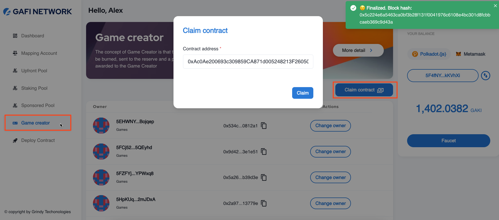
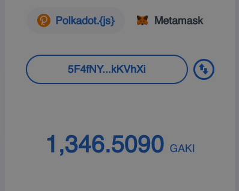

# How to claim developer-onchain-reward

In Gafi, 30 percent of transaction fees will reward to developers(smart-contract owner), in order to claim your reward, you must first claim the ownership of your smart-contract.

<figure><figcaption><p>Claim Contract</p></figcaption></figure>

Following the steps to claim ownership of your smart-contract:

```
1. Navigate to Game Creator Section
2. Claim Contract
```

You can change the owner of the contract by simply clicking on "Change owner". _<mark style="color:yellow;">**Warning**</mark>**:** once you changed the owner, you are no longer the owner of the contract, and "developer-onchain-reward" does not reward you._

After claiming ownership of your contract successfully, every time your contract has been deployed, 30 percent of the transaction fee will go to you immediately.

<figure><figcaption></figcaption></figure>


Developer Onchain Reward Demo

