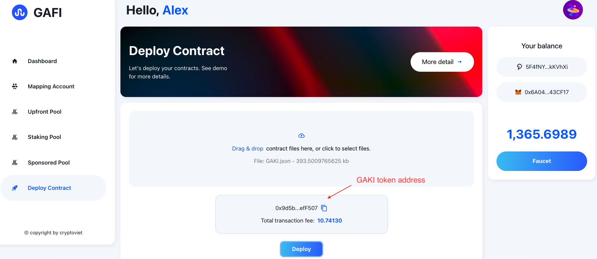
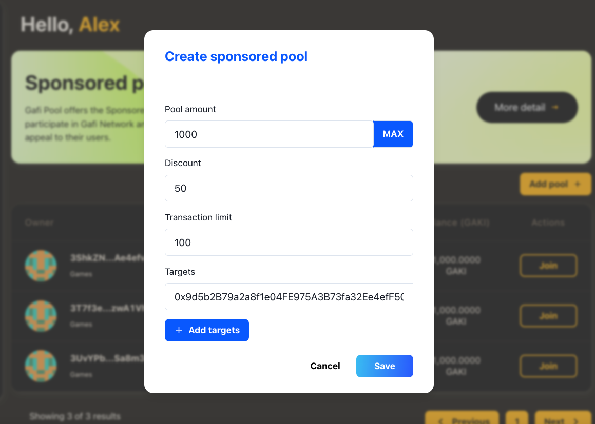
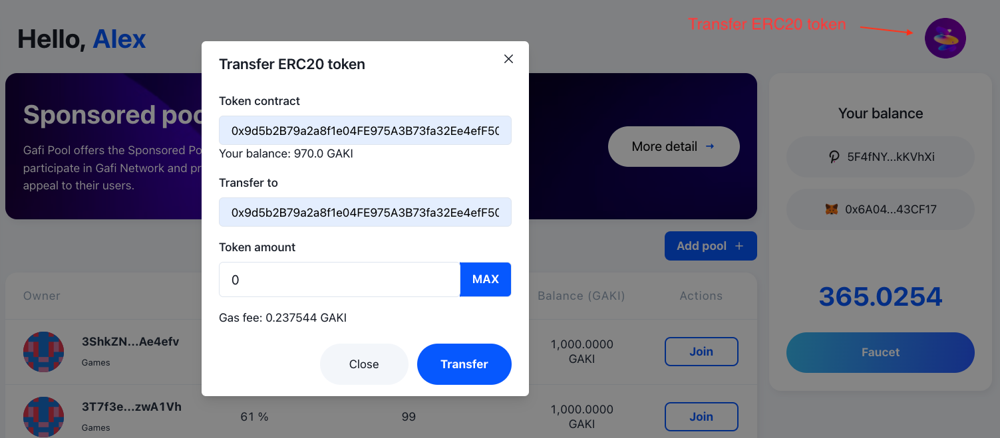
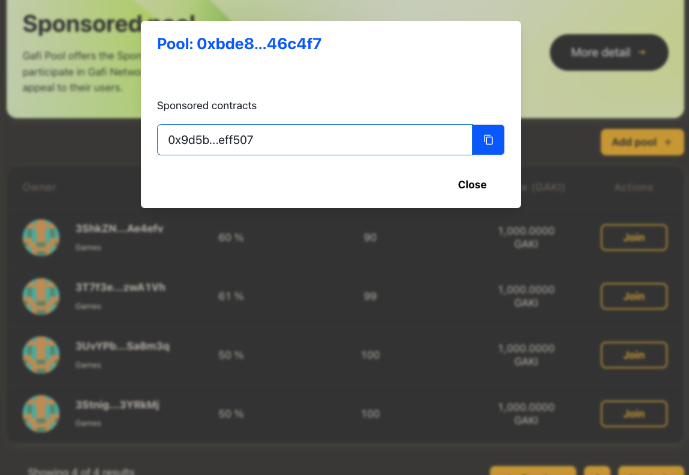

# How to use Sponsored Pool

The purpose of Sponsored Pool is to help game project can create their own pool and help them appeal to their players, please go to [Sponsored Pool](https://wiki.gafi.network/learn/sponsored-pool) to learn more about it.\
Make sure that you have finished mapping your accounts on the [How to Map EVM account with Substrate account](https://wiki.gafi.network/how-to-guides/how-to-map-evm-account-with-substrate-account) section.&#x20;

Following the steps help you understand how Sponsored Pool work:

1. **Deploy contract**\
   ****First, upload the contract ABI or use the demo Token


Demo GAKI token


After deploying successfully, copy the smart contract address you just deployed. In my case which is `0x9d5b2B79a2a8f1e04FE975A3B73fa32Ee4efF507`

**2. Create Sponsored Pool**\
Navigate to [Sponsored Pool](https://apps.gafi.network/admin/sponsored-pool) and click to **Add Pool** to create your own pool.

Now, there are some arguments you need to determine to create the pool:\
**Pool Amount**: the amount of token you going to deposit to the pool\
**Discount**: how much discount of transaction fee when players deploy your contracts\
**Target**: smart-contract addresses that you want your players to interact with

**3. Transfer ERC20 token**

Before joining the pool you just created, let's transfer some erc20 tokens to see the difference

Click the icon on the top-right and by the Token contract, let's fill the GAKI token address you just created above.

After transferring the erc20 token succeeds, you can see the gas fee around 0.23 GAKI.

**4. Join Sponsored Pool**

There are some ways to find your pool, but now let do double-click each pool on Sponsored Pool, so you can see the smart-contract addresses that the pool supported.

Now let's join the pool you created and transfer some erc20 tokens again

**5. Transfer the erc20 token after joining the pool**

.png>)

Now as you can see the transaction fee is cutting half from the first time not joining the pool.

Please note that the Gas will be changing due to network traffic so in some cases your transaction fee can be different.

**6. Change Pool Targets**\
****\
****Pool Targets are the smart-contract addresses that players who join your pool have to make the transaction with in order to get the transaction discounted. In the development period, those addresses are likely to change, so this can be done easily by Change Target.\
Click on [My Sponsored Pool](https://apps.gafi.network/admin/sponsored-pool?type=owned) to edit your pools.

**7. Withdraw the pool**\
****\
****As a pool owner, **** When you no longer want to support your players, you can withdraw your sponsored pool and the remaining balance of the pool will return to you. Click on the pool you want to withdraw.
