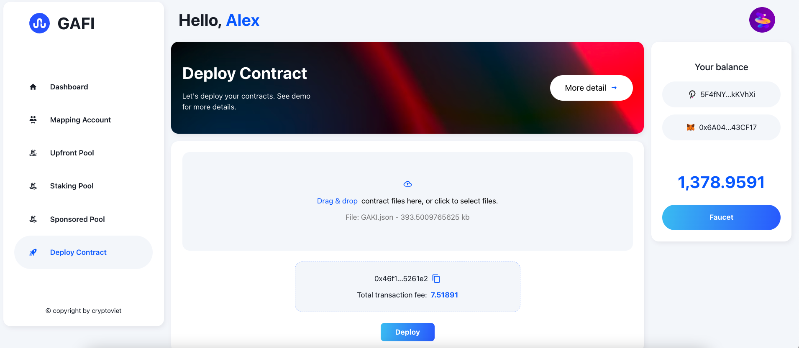

# How to use Upfront Pool

Upfront Pool provides upfront-charge services to reduce transaction fees, please go to [Upfront Pool](https://wiki.gafi.network/learn/upfront-pool) to learn more about it.\
Make sure that you have finished mapping your accounts on the [How to Map EVM account with Substrate account](https://wiki.gafi.network/how-to-guides/how-to-map-evm-account-with-substrate-account) section.&#x20;

Following the steps help you understand how Upfront Pool work:

1. **Deploy contract**\
   ****First, upload the contract ABI or use the demo Token


Demo GAKI token


After deploying successfully, you can see the transaction fee which is \~10.7 GAKI

**2. Join Upfront Pool**\
Now navigate to the [Upfront Pool](https://apps.gafi.network/admin/upfront-pool) section to try the demo. Please note that you can only join one pool at a time so please make sure that you leave Gafi Pool before joining Upfront Pool.

Let's join the Basic of Upfront Pool, then go deploy the contract again.

3\. Deploy contract after joining Upfront Pool

You can see, that now the transaction fee is 7.5 GAKI which is less than 30% compared to the first time not joined the pool.
