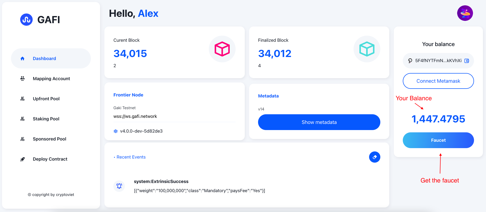

# Demo

Please visit [https://apps.gafi.network/](https://apps.gafi.network/) to try a demo:\
\
**1. Get a faucet**\
\
The first thing you need to do is create your own Substrate account (if you don't have one yet). Please refer to the document of [RMRK](https://www.youtube.com/watch?v=spSPykclJ8I\&ab\_channel=RMRK) or [Moonbeam](https://moonbeam.foundation/tutorials/create-polkadot-js-account/).\
\
Then let's get the faucet.

**2. Connect the Metamask account**\
\
Please create a [Metamask](https://metamask.io/) account if you don't have one, on the [Mapping Account](https://apps.gafi.network/admin/mapping-account) click the Connect Metamask button.

\
**3. Map your addresses**\
\
First, let setup the Gaki network on Metamask

Second, map your Substrate account and Metamask account

After mapping your accounts successfully, you can see your Substrate account sharing the same balance as the Metamask account.

**4. Try to deploy smart-contract**

First, upload the contract ABI or use the demo Token


Gaki ERC20 Token


After deploying successfully, you can see the transaction fee which is \~0.27 GAKI

**5. Join Upfront Pool**\
\
Navigate to [Upfront Pool](https://apps.gafi.network/admin/upfront-pool) and let join the Max

**6. Deploy contracts again**

Now go back to the [Deploy Contract](https://apps.gafi.network/admin/deploy-contract) and deploy contract again

You can see, that now the transaction fee is \~0.08 GAKI which is less than 70% compared to the first time not joined the pool.\

**7. Join Staking Pool**\
\
Because you can only join one pool at a time, you must leave the [Upfront Pool](https://apps.gafi.network/admin/upfront-pool) before joining [Staking Pool](https://apps.gafi.network/admin/staking-pool).

**9. Deploy contracts**\
\
Then go to Deploy Contract again to deploy your contract

Now transaction fee is less than 30% compared with the first time you deployed it.

