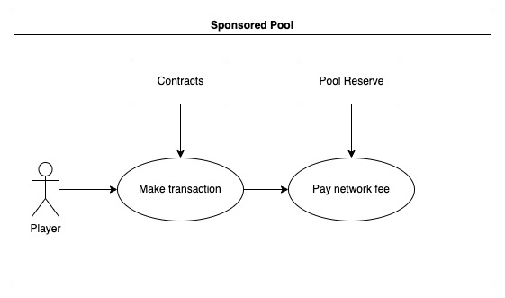

# Sponsored Pool

Gafi Pool offers the Sponsored Pool to give players more options to participate in Gafi Network.\
Help game projects can create their own pool and help them appeal to their players.

The concept of Upfront Pool and Staking Pool is different from Sponsored, those are system-owned pools but Sponsored Pool is the opposite, which means the Sponsored Pool is owned by those who created it.

In case a game project wants to help its players with the transaction fee on Gafi Network, the game project needs to create Sponsored Pool, and determine the pool values: Discount: discount on the transaction fee Transaction Limit: number of discounted transactions in 30 minutes Pool Reserve: the balance of the pool

When their players join the pool, make the transaction with the project's smart contract so the transaction fee of players will be subsidized by the game project.

As a player, when you join Sponsored Pool, in order to get the discount on the transaction fee you have to deploy the correct smart-contract addresses(on the whitelist) and make sure the "Pool Reserve" balance is not too low.

