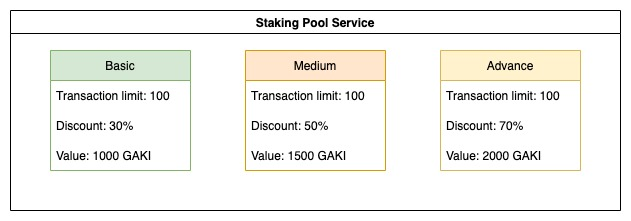

# Staking Pool

* **Staking Pool**\
  \
  Upfront Pool provides staking-like services to reduce transaction fees and enhance network security. Basic, Medium, and Advanced are the three packs you can use when you join the Staking Pool.\

* **Staking Pool Services**

Currently, the default staking value of Basic is 1000 GAKI, 1500 GAKI for Medium, and 2000 GAKI for Advanced for 30%, 50%, and 70% of discount respectively with a limit of 100 transactions in 30 minutes.  By joining the pool, you will lock the staking value to get the discount.\
\
The default service values are justified in the GAKI network when we are using scripts to calculate these numbers, these details can be and should be changed over time by the community to fit with the whole ecosystem.

* **Service Detail**

**Transaction limit** is the number of discounted transactions you get with each service. When your transactions in 30 minutes exceed the transaction limit, you get no more discount on transaction fees.

**Discount** is the value of a percentage discount on transaction fees, so whatever transaction you make, e.g claim your daily reward (0.5 GAKI of fees) or deploy on the battle (5 GAKI fees), you always get a 30% discount in the case of Basic service.

Value is the amount of token that will be locked when using the service. For example in the case of Advance, you will be locked 2000 GAKI when you first join the pool and the same amount will be unlocked when you leave the pool.

Please try the demo to learn more about how Staking Pool work: [https://wiki.gafi.network/how-to-guides/how-to-use-staking-pool](https://wiki.gafi.network/how-to-guides/how-to-use-staking-pool)
