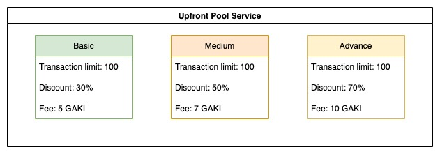

# Upfront Pool

* **Upfront Pool**\
  \
  Upfront Pool provides upfront-charge services to reduce transaction fees and enhance network security. Basic, Medium, and Advanced are the three packs you can use when you join the Upfront Pool.\

* **Upfront Pool Services**

Currently, the default service fee of Basic is 5 GAKI, 7 GAKI for Medium, and 10 GAKI for Advanced for 30%, 50%, and 70% of discount respectively with a limit of 100 transactions in 30 minutes.  By joining the pool, you will be charged a service fee, reserve the same amount of fee at the beginning, and charged every 30 minutes. The appropriate reserve(lock) service fee will be unreserve(unlock) when you leave the pool.\
\
The default service values are justified in the GAKI network when we are using scripts to calculate these numbers, these details can be and should be changed over time by the community to fit with the whole ecosystem.

* **Service Detail**

**Transaction limit** is the number of discounted transactions you get with each service. When your transactions in 30 minutes exceed the transaction limit, you get no more discount on transaction fees.

**Discount** is the value of a percentage discount on transaction fees, so whatever transaction you make, example: claim your daily reward (0.5 GAKI of fees) or deploy on the battle (5 GAKI fees), you always get a 30% discount in the case of Basic service.

The **Fee** is the amount of token you pay when using each service. For example in the case of Medium, you will be immediately charged 7 GAKI, lock 7 GAKI when you first join, and 7 GAKI every 30 minutes. The appropriate amount will be unlocked when you leave the pool.

Please try the demo to learn more about how Upfront Pool work: [https://wiki.gafi.network/how-to-guides/how-to-use-upfront-pool](https://wiki.gafi.network/how-to-guides/how-to-use-upfront-pool)
