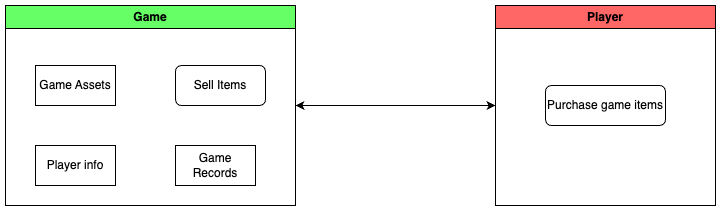

# Web3 Gaming Structure

1. **Traditional Game Model**

<figure><figcaption>
Traditional GameStructure
</figcaption></figure>

* In the traditional game model, games and players exist within a centralized structure. All data, including game assets, player information, and game records, is stored within the game itself. However, this centralized model poses significant risks, as game servers are vulnerable to attacks and exploits, potentially leading to the complete loss of the game.
* In this model, in-game items are created and sold to players without transparent information on their rarity or quantity. Furthermore, there is no market for trading game items, resulting in one-way purchases.

2. Web3 Gaming introduces a new paradigm, represented by the triangle of Blockchain, Players, and Games.

<figure><figcaption>
Web3 Game Structure
</figcaption></figure>

Gafi, within the Web3 game model, aims to address the shortcomings of the traditional model by storing in-game assets, in-game records, and player information securely on the blockchain. This ensures a higher level of security and eliminates the vulnerability associated with centralized game servers.

One of the key mechanisms introduced by Gafi is Transparency Random Mint, which allows players to mint NFTs with trust and transparent randomness, enhancing the fairness and integrity of the game.

The marketplace within the Web3 game model provides exceptional value to in-game finance. Players have the freedom to engage in various financial operations with their assets, creating a dynamic and thriving ecosystem.

Players within this model enjoy a heightened level of control over their in-game assets and can freely trade NFTs on the Gafi Market. This empowers players to fully immerse themselves in the game and actively participate in the economy surrounding it.

From a game studio perspective, Web3 gaming offers exclusive features that enable easy creation and management of collections and NFTs within minutes. This streamlined approach allows game studios to embrace the benefits of blockchain technology and enhance the gaming experience for their players.

Compared to the traditional game model, Web3 games leverage Gafi as a trusted authority between the game and the player. Gafi provides a robust solution for storing game data and player assets on the blockchain, ensuring security and integrity. The Gafi Market unlocks the potential for games and players to excel in the realm of game finance.

Join us in the Web3 Gaming revolution, where trust, transparency, and empowerment redefine the gaming industry. Together, we can create a future where games are built on a solid foundation of blockchain technology, providing unparalleled experiences for players worldwide.
